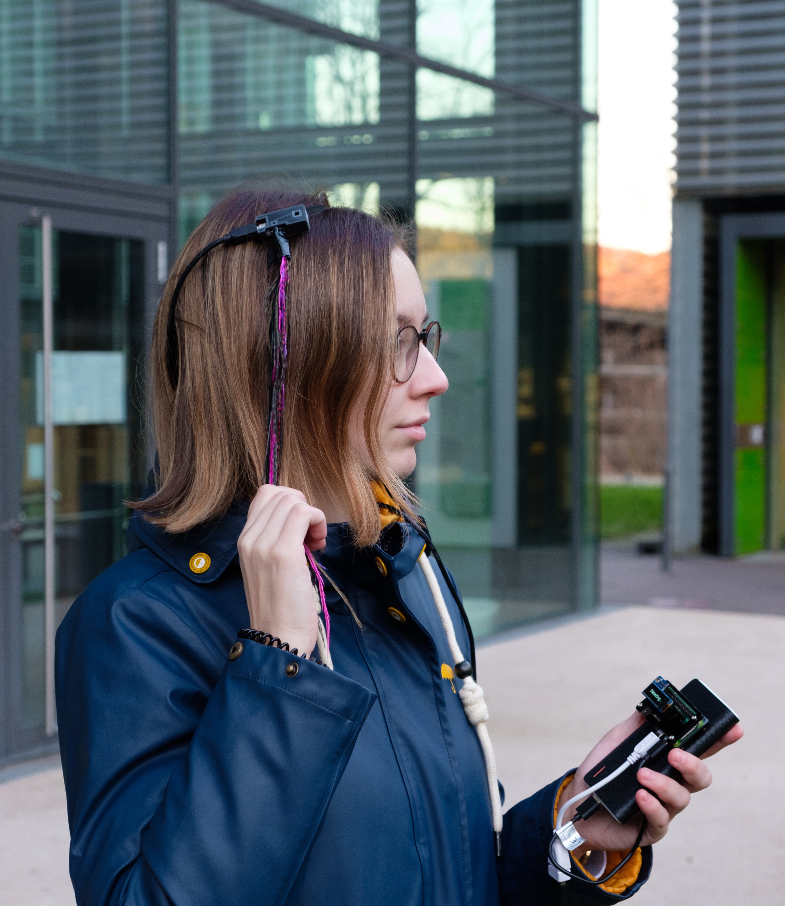

# FeatherHair: Interacting with Sensorized Hair in Public Settings
Dataset and code for the prototype provided in the ACM pictorial 'FeatherHair: Interacting with Sensorized Hair in Public Settings' ([(https://doi.org/10.1145/3532106.3533550)](https://doi.org/10.1145/3532106.3533550)) published at the Designing Interactive Systems Conference 2022 (https://dis.acm.org/2022/).  This project was conducted by the [HCI Lab](https://hci.cs.uni-saarland.de) of the Saarland Informatics Campus.

<p float="left">
  
   
</p>

### Used Software:
Below listed are the library versions used for the implementations. We cannot guarantee a proper working code if other versions than those mentioned here are used.

**Microcontroller:**
- ```CircuitPython 7.0.0```

**Microcomputer:**
- ```Python 3.9```
-  ```Numpy 1.19.5```
-  ```Pandas 1.3.0```
-  ```PyWavelets 1.1.1```
-  ```tkinter 8.6```

### Used Hardware:
- Microcontroller: [ItsyBitsy M0 Express](https://learn.adafruit.com/introducing-itsy-bitsy-m0/overview)
- Microcomputer: [Raspberry Pi Zero WH](https://www.raspberrypi.com/products/raspberry-pi-zero-w/) + Adafruit PiOLED


